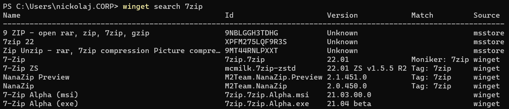
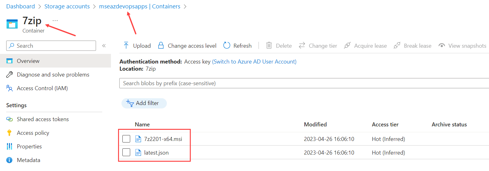

# Onboarding a new app
## applist.json
Start by having a look at the applist.json file. We're going to add the application to this list first.

Adding an app means you need to fill out the same fields as the other applications: 

```powershell
{
    "IntuneAppName": "<<Display name of the application to be used in Intune>>",
    "AppPublisher": "<<Publisher>>",
    "AppSource": "<<SELECT[Winget, Evergreen, StorageAccount]>>",
    "AppID": "<<ID of the app in the source repo>>",
    "AppFolderName": "<<Must match the name of the sub-folder in the Apps folder>>",
    "AppSetupFileName": "<<Name of the application setup file>>",
}
```
### IntuneAppname 
The display name for the application in Intune. Field is freetext. 

### AppPublisher
Who published the app. Field is freetext. 

### AppSource
Pick a repository to check for new versions. 

### AppID
The AppID is found in the specific repo - here an example from winget: 
  

  
### AppFolderName 
We need to create a folder for our new App. In the "Apps" folder, create a new folder for your Application, and write the name of that new folder here.

### AppSetupFileName
Whatever the name of the installer is, should be inputted here.

# Apps folder 
Next step is creating a folder in the "Apps" section with the name of your new Application. 

If you're in any doubt, look at the other apps in the applist.json file.
If you're using the Evergreen Repo, do note that you need to add some filter options to the app: 

```powershell
{
    "IntuneAppName": "<<Display name of the application to be used in Intune>>",
    "AppPublisher": "<<Publisher>>",
    "AppSource": "<<SELECT[Winget, Evergreen, StorageAccount]>>",
    "AppID": "<<ID of the app in the source repo>>",
    "AppFolderName": "<<Must match the name of the sub-folder in the Apps folder>>",
    "AppSetupFileName": "<<Name of the application setup file>>",
}
```

The folder _has_ to contain the following: 

- an App.json file 
- an Icon.png file
- some kind of deployment script


### _app.json file_
In the template folder, grab the app.json file and copy it to your new folder. The fields with <replaced by pipeline> should be left alone. 

### _icon.png file_
Should be selfexplanatory as well - the icon that is uploaded in Intune. The file **has to be named Icon.png** or the pipeline will fail. 

### _some kind of deployment script_
use the deploy-application.ps1 from the template folder and use one of the sample lines if you dont have any crazy installation instructions for your app.

### app.json rundown 
Lets start with having a look at the app.json file. Open up the template folder and look at the App.json file in there for starters.

As said, you'll find that a lot of the fields are inputted with <<replaced by pipeline>>. That means 'leave this field, the pipeline will take care of these values'! If you have intune experience, you'll find that these fields represent a similar box in Intune if you were to deploy the app yourself. 

Copy over the app.json to your new applcation folder. Write a description in line 12, and go through all the lines that has "Select value" listed. 

If you're ever in doubt about the detection rule, install the app and have a look at the registry for this application - preferably the version comparison if at all possible. This should be your go-to - detection rules that looks at files will eventually have issues because files change names in versions, changes extensions, changes folders.. You get the idea.

### Icon.png rundown
Icon.png should be self-explanatory. pick an Icon, name it as said - the pipeline will throw an error if it's named anything else.

### Deploy-application.ps1 rundown
deploy-application.ps1 is a lot of text, but what we really want to look at is the section that says ###installation###. In there, pick an install line that is suitable and do the same for uninstall. Then move on. 

# What about storage account based apps? 

We have the latest.json file for that! Grab that file from the template folder, fill out the name of the setup file and the setup version, and you're good to go.
Whenever you need to update the Application, make sure you update the 'setupversion' line as well, and the pipeline will push the new version for you.

```powershell
{
    "SetupName": "<file_name>",
    "SetupVersion": "<version>"
}
```
And yes, you still need to create a folder for it in the 'apps' section. Those files are mandatory. just make a note that in the applist.json file we dont point at a repo, but at our storage account. Speaking of which..
The applist.json file looks a little bit different: 

```powershell
{
    "IntuneAppName": "7-Zip",
    "AppPublisher": "Igor Pavlov",
    "AppSource": "StorageAccount",
    "AppID": "",
    "AppFolderName": "7zip",
    "AppSetupFileName": "setup_7zip.msi",
    "StorageAccountName": "mseazdevopsapps",
    "StorageAccountContainerName": "7Zip"
}
```
AppID should remain blank, we're not asking any repos for the ID so this is not needed, and the StorageAccountName & StorageAccountContainerName is added. Storageaccountname should be selfexplanatory, the ContainerName should be the name of a fresh container for the setupfile and latest.json file. 

